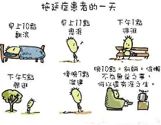
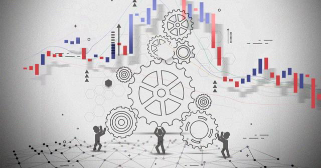

这是最关键的认知纠偏。心理学研究表明，拖延的本质是情绪调节失败——我们拖延不是因为不想做，而是因为做这件事会触发焦虑、恐惧、自我怀疑等负面情绪，拖延是逃避这些情绪的短期策略。剧本通过A"一坐到书桌前就难受"的台词，精准传达了这一点。
1. 完美主义与拖延的共生关系
"等状态好了一次性搞定"是拖延者最常见的自我欺骗。研究显示，完美主义者的拖延率显著更高，因为完美主义设定了一个不可能的标准，而"不开始"是唯一不会失败的方式。
## 剧本简介
小明同学不想完成作业，喜欢把大把时间投入到娱乐中，所以在写作业的过程中出现了很多拖延的行为。作业等到最后一天写，游戏一直在玩，输了要一雪前耻，赢了要乘胜追击；写作业没头绪就开始做其他的事情，完全没有投入其中；在经历了惨重的教训后，他终于决定改变对必须要完成的事情的态度，不再拖沓。
##  剧本分析
剧本触及了拖延症研究的几个核心发现：

1. 拖延 ≠ 懒惰
这是最关键的认知纠偏。心理学研究表明，拖延的本质是情绪调节失败——我们拖延不是因为不想做，而是因为做这件事会触发焦虑、恐惧、自我怀疑等负面情绪，拖延是逃避这些情绪的短期策略。剧本通过A“一坐到书桌前就难受”的台词，精准传达了这一点。

1. 完美主义与拖延的共生关系
“等状态好了一次性搞定”是拖延者最常见的自我欺骗。研究显示，完美主义者的拖延率显著更高，因为完美主义设定了一个不可能的标准，而“不开始”是唯一不会失败的方式。

1. 时间折扣效应
人类大脑对即时奖励的权重远高于远期奖励。打游戏的多巴胺反馈是即时的，而论文的成就感是延迟的。这不是意志力问题，而是神经机制问题。

1. 飞轮效应的科学性
剧本推荐的“只做5分钟”方法，在认知行为疗法中被称为结构化拖延或微启动策略。原理是：行动门槛一旦降低到“只做5分钟”，焦虑感就会大幅下降；而一旦开始，大脑的任务切换成本已被支付，继续下去的阻力骤减。这与“飞轮效应”的比喻一致：最费力的是推动静止飞轮的第一圈。

## 剧本总结
拖延症实质上是一种习惯性地推迟、延迟或推延完成任务的行为模式。即使任务紧急或重要，为了逃避任务带来的负面情绪（如焦虑、无聊或不安等），拖延者便会找各种理由避免立即行动。
它会影响身心健康，影响工作与学业表现，还会影响长期目标实现，最后严重到形成恶性循环，变成长期的习惯，难以打破。
日常想要避免拖延症的影响，可以尝试这些方法：
- 番茄工作法：专注25分钟，休息5分钟，提高耐力.
- 减少干扰：上课/工作时把手机丢远点，别让通知诱惑你！
- 给自己设定规则：比如“先完成任务，再看剧”.
- 改善情绪调节：别让“负面情绪”拉你下水！
有时候，我们拖延并不是因为懒，而是害怕任务带来的焦虑！每次打开Word，看到空白页，就觉得头皮发麻——这不是拖延，是情绪在作祟！
简单来说，就是换个角度看待任务，让它变得没那么可怕！
举个栗子 ：
• 以前：“完蛋，这论文太难了，我根本做不来！”（焦虑值+100）
• 现在：“这只是一步一步完成的任务，先搞定第一部分。”（焦虑值-50）
情绪稳定的人，拖延症会少很多！
- 还可以提前想象自己完成任务的感觉，让奖励感变得更具体，更有吸引力，这样拖延的可能性就会降低。
## 剧本播放
最后，让我们欣赏一下剧本的播放视频吧！